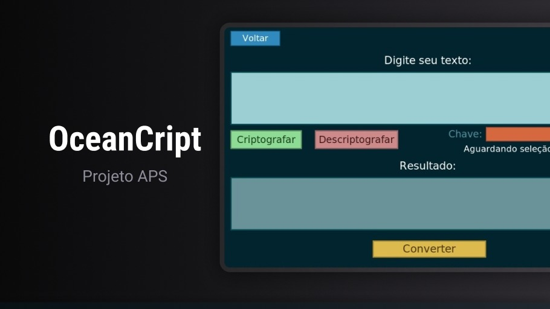

<h1 align="center"> OceanCript </h1>

  

## 💻 Projeto

OceanCript é um sistema de criptografia desenvolvido para proporcionar segurança e eficiência na comunicação de um navio transportador de carga tóxica. Este sistema foi concebido com a finalidade de assegurar a transmissão de mensagens de maneira segura e eficaz, contribuindo assim para a preservação da integridade da carga e a mitigação de potenciais riscos associados. 

## 🚀 Tecnologias

Esse projeto foi desenvolvido com as seguintes tecnologias:

- Python
- TKinter
- Git e Github
- Figma

## :handshake: Contribuidores

<table>
  <tr>
    <td align="center">
      <a href="https://github.com/Guilcky">
         
        
          <strong>Guilherme Dias</strong>
        
      </a> 
    </td>
    <td align="center">
      <a href="https://github.com/Guiswer">
         
        
          <strong>Guilherme Leandro</strong>
        
      </a> 
    </td>  
    <td align="center">
      <a href="https://github.com/helen-silv4">
         
        
          <strong>Helen Silva</strong>
        
      </a> 
    </td>
    <td align="center">
      <a href="https://github.com/luizfili">
         
        
          <strong>Luiz Felipe</strong>
        
      </a> 
    </td>
  </tr>
</table>  

## :memo: Licença

Esse projeto está sob a licença MIT.
